# Hoomy

  

AI can do more than ever. Your attention is still the bottleneck. Hoomy explores a lifelong AI companion that learns what matters to you as your priorities change—and when to act, ask, or stay quiet. The aim is meaningful progress in real life, not more time spent managing AI. You stay in control of what it sees, remembers, and does. Our first use case is a coding-agent chief of staff, built through small experiments that anyone can inspect, contribute to, and eventually use.

[Read the project charter](CHARTER.md) for the longer-term research direction.

## The first experiment

We are building one small thing first:

> Can Hoomy turn a completed Codex session into a brief that is accurate, traceable, and quick to correct?

The first public prototype will:

1. read a session selected by the user;
2. summarize its intention, outcome, open questions, and possible next step;
3. link every important statement to evidence in the local session;
4. let the user accept, edit, or remove what Hoomy produced.

It is not usable yet. [EXP-0001](experiments/EXP-0001-conversation-brief/README.md) defines the pilot and the decision it must support.

## What comes next

The next project update will contain:

- a locally runnable prototype;
- instructions for using it with sessions you control;
- the aggregate pilot result, including failures and the decision about what to do next.

No source session will be published.

## Privacy

- Source sessions remain under the user's control. Hoomy does not collect or publish them.
- The prototype has no telemetry.
- This project provides no public or synthetic conversation corpus.
- Never post conversations, prompts, credentials, private names, repository names, or local paths in an issue or pull request.

The prototype is local software. If external inference is introduced, Hoomy must show what will leave the device and who will receive it before the run begins.

## Take part

Right now, useful contributions are focused: challenge the experiment, help build the prototype, or review the result. Open an issue before substantial work and keep pull requests small. This is a maintainer-led project, and no contribution should contain private source material.

## License

Code is licensed under [Apache-2.0](LICENSE). Documentation and research are licensed under [CC BY 4.0](LICENSE-DOCUMENTATION.md). Any future CC0 material will be clearly marked where it appears.
